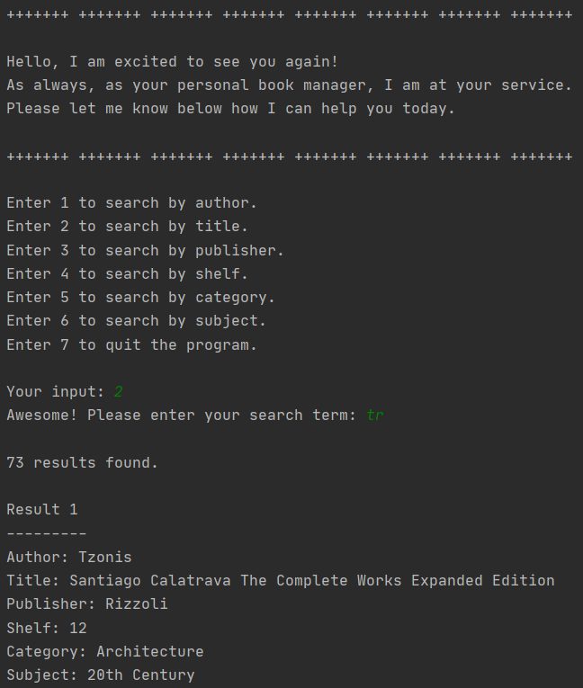
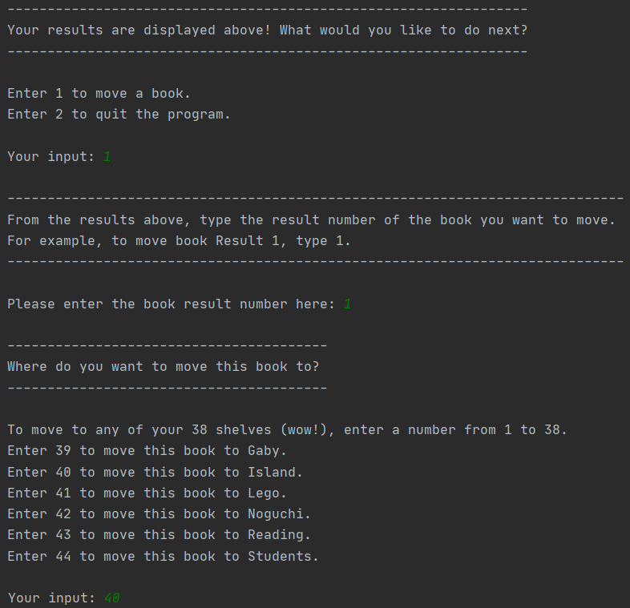
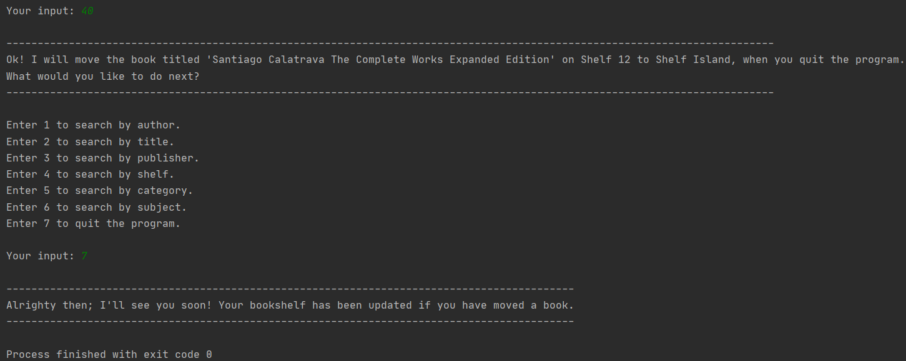
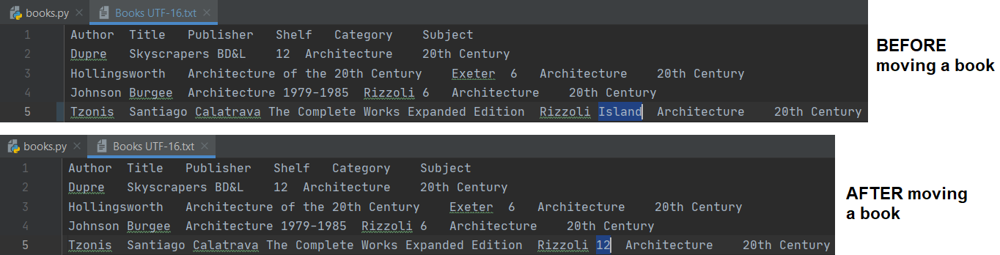

# Book Manager

## Program Overview
This is a python program to search and organize books, created as part of a python course assignment.  

The user is prompted for a variety of actions for the program to perform, such as search for a book, move a book to a different shelf, and quit the program. A .txt file contains the details of the user's books, which is updated if the user moves a book and quits the program.
 

## Demo
Here are four screenshots to demonstrate how the program works:
  

1) First, the user is greeted with a message to signal that the program has started. The user is prompted to search for a book in a variety of ways in which a book can be located (E.g search by author, title, publisher etc.). To make the program easier to use and prevent misspellings, the user only needs to enter the corresponding number. The user can then search by a partial or full term. A detailed list of results are displayed for the user in an organized and clear manner.

Not shown: Any numbers entered that are out of range, the user will be informed that the input is out of range and will be prompted to re-enter a number in range.

 

2) The user is then given a choice to move a book or quit the book manager program. As shown, the user entered “1”, which then gives further instructions on how to select a book to move. The user then chooses where to move the book to on the virtual bookshelf (There are 38 numbered shelves and 6 named shelves).

Not shown: Any numbers entered that are out of range, the user will be informed that the shelf does not exist and will be prompted to re-enter a number in range.

 

3) After moving a book, a confirmation message informs the user the title of the book that will be moved and to what shelf. The user then decides to quit the program and is presented with a goodbye message.
  

 

4) As mentioned, all the details of the books are stored in a .txt file, with the first row as the book data description. The appropriate book details are in columns under the headings. The columns are separated by one-tab space. In line 5 of the top screenshot snippet, the book was on Shelf 12 before the user moved it with the program. In the bottom screenshot snippet, the book had been moved to Shelf Island.
  

